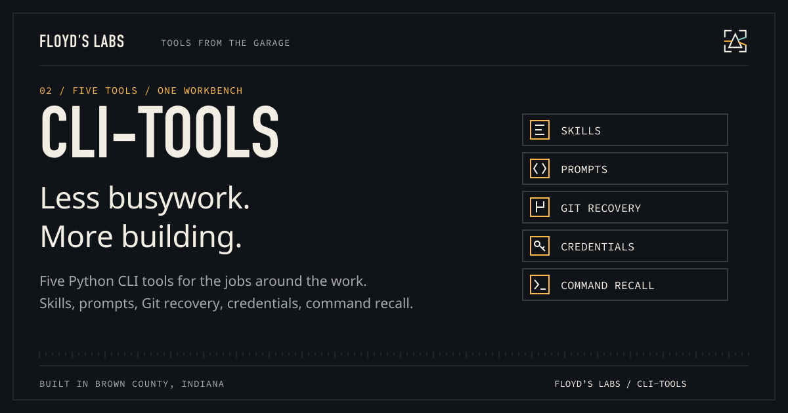

# Floyd’s CLI Tools



**Five tools. Fewer things to do twice.**

Find useful agent skills, compose prompts, recover unsaved Git work, inventory credentials, and recall commands from your own transcripts. Built at Floyd’s Labs: one garage, two black cats, and tools that have to earn the desk space.

[Download v1.0.0](https://github.com/CaptainPhantasy/CLI-TOOLS/releases/tag/v1.0.0) · [Report a bug](https://github.com/CaptainPhantasy/CLI-TOOLS/issues) · [Floyd’s Labs](https://floyd-labs-proving-ground.captainphantasy.chatgpt.site/open-source)

## Get it running

Requirements: **Python 3.11+, Git; Node.js 20+ for view tests**.

Download and unpack the release archive:

```sh
tar -xzf floyd-cli-tools-1.0.0.tar.gz
cd floyd-cli-tools-1.0.0
./install-global.sh
# Add ~/.local/bin to your PATH, then:
skiller --help
salvager --roots /absolute/path/to/projects
```

The installer defaults to `~/.local`. For another location, use `./install-global.sh --prefix /absolute/path`. It installs five Python tools and three MCP App servers without copying credentials or personal indexes.

| Tool | What earns its place |
| --- | --- |
| SKILLER | Find and index agent skills |
| PROMPTER | Browse and compose reusable prompts |
| SALVAGER | Rank Git work that is still only on disk |
| KEYRING | Inventory credential locations without printing values |
| RECALLER | Search commands in your own agent transcripts |

MCP servers: `keyring-app`, `salvager-app`, and `recaller-app` use stdio. Configure their installed absolute executable paths in your host. MCP Apps views require a compatible host; text tools remain available without the view extension. The host must enforce app-only visibility for credential reveal. Optional GLM explanations require your own API configuration and may incur provider charges.

## What is in the box

The release includes `floyd-cli-tools-1.0.0.tar.gz`, source where applicable, and `SHA256SUMS.txt`. Use the tagged release's named assets for installation; GitHub's automatic source archives are snapshots. Verify a download with `shasum -a 256 -c SHA256SUMS.txt` after downloading the matching files.

## Show the work

`python3 test-mcp-apps` checks protocol behavior, model-visible secret redaction, narrow write tools, and rendered views using synthetic isolated fixtures. `node view-harness.mjs` is used by that suite. The installer is separately exercised under a temporary prefix.

## Contribute or get help

Open an issue with your platform, version, command, and a minimal reproduction. Keep credentials and personal transcripts out of reports. See [CONTRIBUTING.md](CONTRIBUTING.md) and [SECURITY.md](SECURITY.md).

## License

The repository has no open-source license granting redistribution rights. Existing restrictions are preserved; a public download does not change those rights.

---

Built with intent. Bella checks the keyboard. Bowser watches the router.
